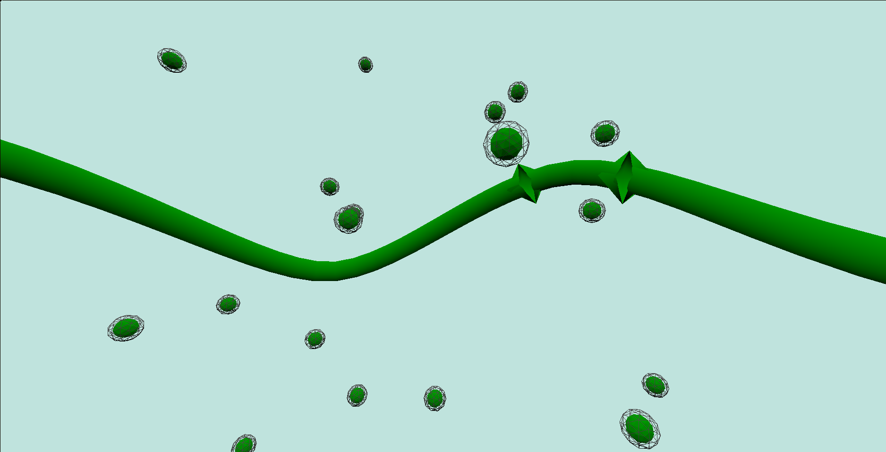

# 🌐 Octahedrons... LOTS OF OCTAHEDRONS >:3

An interactive 3D visualization made with [Three.js](https://threejs.org/) — featuring dozens of animated icosahedrons, moving spheres, and a centralized path rendered as a tube.



## ✨ Overview

This project is a 3D scene built using `Three.js`, featuring:

- 💠 Multiple **icosahedrons** scattered in 3D space, each with a wireframe shell  
- 🌐 **Spheres** that animate along a smooth, looping spline  
- 🌀 A **tube geometry** that follows the same spline path  
- 💡 Soft global lighting using a hemisphere light  
- 📐 A **centralized curve path** to keep geometry balanced around the origin  

## 🚀 How to Run

This project uses ES6 modules and must be served using a development server.

To run it using [Vite](https://vitejs.dev/):

1. Make sure you are in the `octahedrons` project folder.
2. Run the project with: 
   ```bash
   npx vite
    ```


## 🧠 Key Features

- `IcosahedronGeometry` with both shaded and wireframe materials  
- `SphereGeometry` instances animated along a `CatmullRomCurve3`  
- Real-time animation using `renderer.setAnimationLoop`  
- Responsive resizing on window resize  
- Centralized spline to ensure consistent geometry placement  

## 🛠 Technologies Used

- [Three.js](https://threejs.org/) for WebGL rendering  
- JavaScript ES6 Modules  
- HTML5 & CSS3  