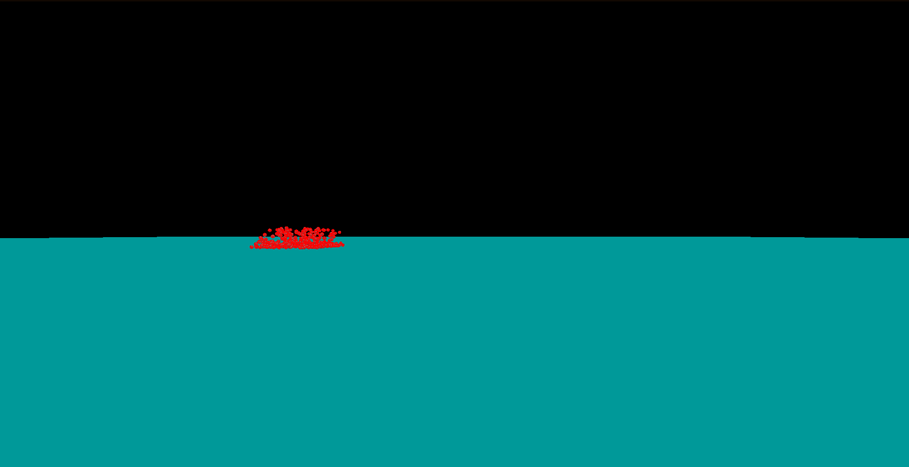
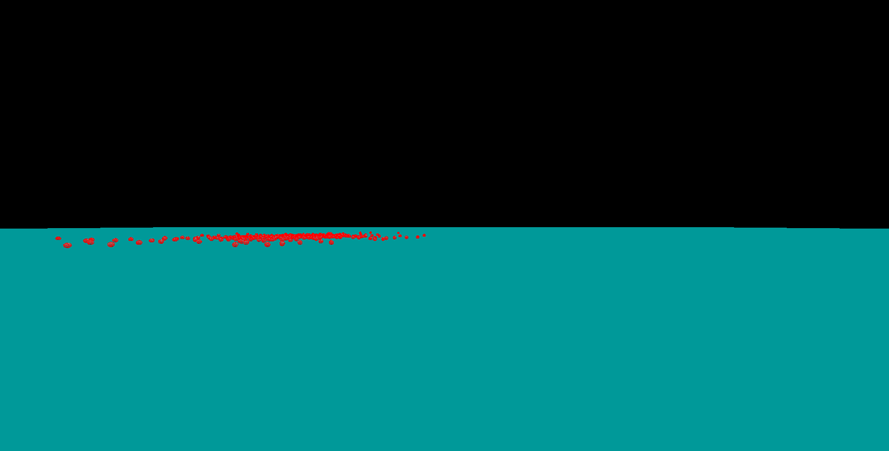

# 🧪 Rapier Physics + Three.js Test

A real-time physics simulation using [Rapier3D](https://rapier.rs/) (via WASM) integrated with [Three.js](https://threejs.org/), featuring 500 falling dynamic spheres interacting with a fixed ground plane — all rendered in the browser with camera control via OrbitControls.




## 🌐 Overview

This project creates a basic but visually rich physics sandbox:

- ⚙️ Powered by **Rapier3D** for real-time physics (via WASM)
- 💠 Each falling object is a **wireframed icosahedron**
- 🧱 A large static **ground collider**
- 🌀 Uses **Three.js** for rendering and **OrbitControls** for camera control
- ✨ Lighting and responsive canvas resizing

## 🚀 How to Run

Because this project uses ES6 modules and WebAssembly from external CDNs, it must be run from a local development server.

To run it with [Vite](https://vitejs.dev/):

1. Make sure you are in the `octahedrons` project folder.
2. Run the project with:

   ```bash
   npx vite
